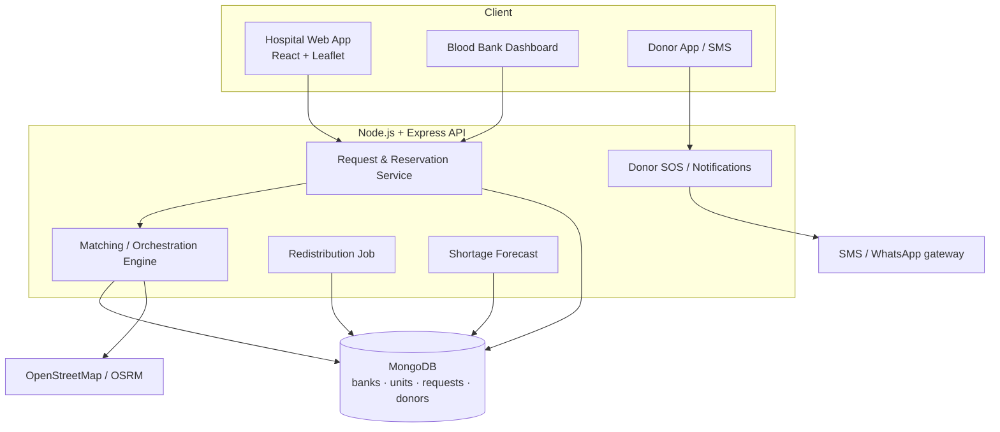
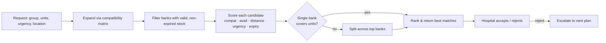
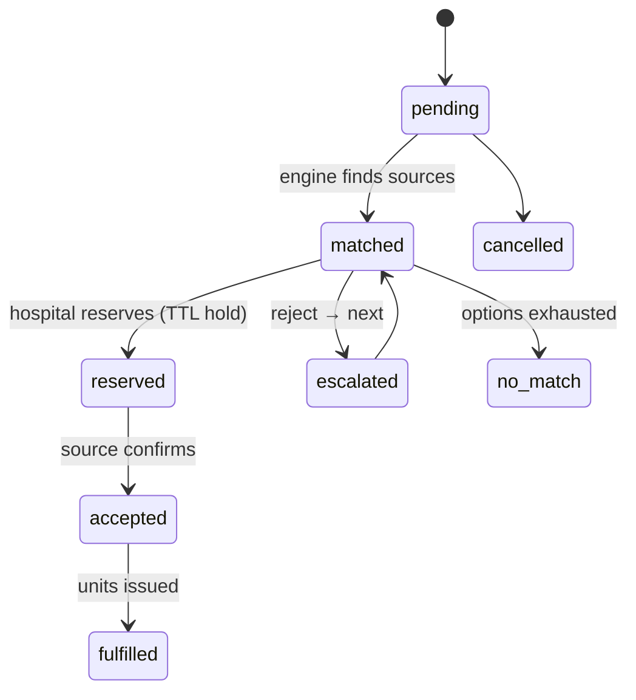

# RaktaSetu — Real-Time Emergency Blood Orchestration Platform

> **Ignition Hackathon · MVP** · Team of 4
> Stack: React · Node.js + Express · MongoDB · Leaflet/OpenStreetMap
> One-liner: *A 911 for blood — request, match, and reserve medically-compatible blood in seconds, while the network predicts shortages and redistributes units before they expire.*

---

## 1. The Problem

During a trauma or surgical emergency, the **golden hour** is often lost on logistics, not medicine.

- Blood availability is **fragmented** across blood banks, hospitals, and donors — there is no single real-time view of who has the right group in stock, right now, nearby.
- Matching is done **manually and by exact group** over the phone. Under pressure, compatibility (O− is a universal donor, AB+ a universal recipient) and expiry are ignored.
- Rare groups (**O−, and the Bombay `hh` group**) are almost impossible to source quickly.
- Meanwhile, **lakhs of blood units are wasted in India every year** — a large share simply expiring unused on a shelf a few kilometres from where they were needed.

**Net effect:** patients wait, hospitals scramble, and usable blood is thrown away — at the same time.

---

## 2. Our Solution — What We Are Building

RaktaSetu puts hospitals, blood banks, and eligible donors on **one real-time platform** and turns "find blood" into an **orchestrated, prioritized workflow**.

A hospital raises an emergency request (group, component, units, urgency). RaktaSetu instantly returns **ranked, available, medically-compatible sources**, lets the hospital **reserve** in one tap, and **auto-escalates** to the next-best source if the first declines.

On top of that request/response loop, three network-level engines make RaktaSetu an *orchestrator*, not just a finder:

1. **Zero-Waste Redistribution** — proactively moves near-expiry units from surplus banks to high-demand banks (FEFO).
2. **Predictive Shortage Engine** — forecasts which group will run short, where, in the next few days.
3. **Donor SOS** — broadcasts to nearby eligible donors when banks can't cover rare groups.

### What's already built (Phase 0 ✅)
The current Express MVP (`Backend/`) already does:
- `GET /api/blood-stock` — list banks + inventory
- `POST /api/requests` — create request, run matching, store it (in-memory)
- `POST /api/reserve` — decrement a bank's inventory
- `POST /api/accept` / `POST /api/reject` — accept, or escalate to next match
- A scoring **matching engine** (availability + distance tier + urgency)

This plan takes that skeleton and turns it into the platform above.

---

## 3. How the Orchestration Works (the heart of the project)

### 3.1 Blood-group compatibility (currently missing — the #1 fix)
Today the engine only does an **exact** group lookup, which is medically incomplete. We add a **red-cell (RBC) compatibility matrix** — for each recipient group, which donor groups are safe:

| Recipient | Can receive from (RBC / whole blood) |
|-----------|--------------------------------------|
| O−  | O− |
| O+  | O−, O+ |
| A−  | O−, A− |
| A+  | O−, O+, A−, A+ |
| B−  | O−, B− |
| B+  | O−, O+, B−, B+ |
| AB− | O−, A−, B−, AB− |
| AB+ | **all groups** (universal recipient) |

> Plasma compatibility is the **inverse** of this — handled later at the component level (§4.2).

### 3.2 The scoring model (v2)
For every candidate `(bank, donorGroup)` that can satisfy the request, compute a 0–100 score:

```
score =  w_compat  · compatibilityScore     // exact match > compatible substitute
       + w_avail   · availabilityScore       // enough units in stock?
       + w_dist    · distanceScore           // haversine from hospital (closer = higher)
       + w_urgency · urgencyScore            // critical > urgent > routine
       + w_expiry  · expiryScore             // FEFO: soonest-expiring valid unit ranks higher
       − penalty_rareStock                    // discourage burning O−/rare stock on non-rare needs
```

Two ideas that make this "smart":
- **Prefer exact match, preserve universal stock.** An A+ request should pull A+ first; using precious O− to fill an A+ need is penalized unless nothing else fits.
- **FEFO reduces waste.** Among equally-good options, prefer the unit closest to expiry (but still valid) — so blood gets used before it's binned.

### 3.3 Multi-bank split fulfilment (true orchestration)
If no single bank can supply the full quantity, RaktaSetu **splits** the order across the top-ranked banks (e.g. 4 units from Bank A + 2 from Bank B), reserves at each, and presents it as one coordinated fulfilment plan.

### 3.4 Zero-Waste Redistribution
A background job scans inventory for units within *N* days of expiry, finds banks with **forecast demand** for that group, and proposes transfers — closing the loop between "about to be wasted here" and "about to be needed there."

### 3.5 Predictive Shortage Engine
A lightweight model over historical/seasonal usage (accidents, dengue season, festivals) flags **`group → bank → predicted-short date`** so banks can top up *before* the emergency.

### 3.6 Donor SOS
When banks can't cover a rare group, broadcast to nearby donors who are **eligible** (last donation ≥ 90 days ago) and opted-in, via SMS/WhatsApp/push.

---

## 4. Core Concepts & Rules

### 4.1 Request lifecycle (status machine)
`pending → matched → reserved → accepted → fulfilled`
with branches `→ escalated` (reject → next match) and `→ no-match` (options exhausted), plus `cancelled`.

### 4.2 Components (Phase 3+)
Hospitals need **components**, not generic "blood": Whole Blood, **PRBC** (packed red cells), **Platelets**, **Plasma (FFP)**, **Cryoprecipitate**. Each has its own shelf life and compatibility rule (plasma inverts the RBC matrix). MVP can start at whole-blood/PRBC and expand.

### 4.3 Reservation holds
A reservation is a **time-boxed hold** (e.g. 15 min TTL) that decrements *available* but not *issued* stock, and auto-releases if not confirmed — preventing double-booking and phantom shortages.

---

## 5. Flowcharts

### 5A. System Architecture


### 5B. Matching / Orchestration Pipeline


### 5C. Request Lifecycle


---

## 6. Tech Stack

| Layer | Choice | Notes |
|-------|--------|-------|
| Frontend | **React** (Vite) + **Leaflet/OSM** | Hospital request flow, bank dashboard, live map + ETA |
| API | **Node.js + Express 5** | Current codebase; keep controllers/services split |
| Database | **MongoDB** + Mongoose | `2dsphere` geo index for nearby-bank queries |
| Geo/Routing | OpenStreetMap, optional **OSRM** | Haversine for MVP, routing/ETA later |
| Notifications | Twilio / WhatsApp (trial) or **mocked** | Donor SOS; mock for demo to avoid cost |
| Forecast | Simple model (moving avg / regression) | Runs on seeded historical data |
| Dev | nodemon, dotenv, ESLint | move `nodemon` to `devDependencies` |

---

## 7. Data Strategy & Data Model

### 7.1 The dataset problem
Real blood-bank inventory feeds aren't publicly available for a hackathon. We **seed realistic synthetic data**: ~10–15 banks with lat/long around one city, per-group inventory with staggered **expiry dates**, ~50 donors with `lastDonationDate`, and a few weeks of synthetic usage history for the forecast. A `scripts/seed.js` makes the demo reproducible.

### 7.2 Core collections (Mongoose, simplified)
```
BloodBank   { _id, name, location:{type:"Point", coordinates:[lng,lat]}, contact, verified }
BloodUnit   { _id, bankId, bloodGroup, component, units, collectionDate,
              expiryDate, status:"available|reserved|issued|expired" }
Hospital    { _id, name, location, contact }
Request     { _id, hospitalId, bloodGroup, component, units, urgency,
              status, matches:[...], currentMatchIndex, createdAt }
Reservation { _id, requestId, bankId, bloodGroup, units,
              status:"held|confirmed|released|expired", expiresAt }
Donor       { _id, name, bloodGroup, location, lastDonationDate, optIn, contact }
Forecast    { _id, bankId, bloodGroup, predictedShortDate, confidence }   // optional
```

### 7.3 API contract (target)
```
GET   /api/blood-stock                 list banks + inventory (filters: group, component)
GET   /api/banks/nearby?lat&lng        geo query
POST  /api/requests                    create request → returns ranked match plan
GET   /api/requests/:id                status tracking            ← NEW
GET   /api/requests                    list / filter
POST  /api/requests/:id/reserve        time-boxed hold, tied to request  ← improved
POST  /api/requests/:id/accept         confirm & issue units
POST  /api/requests/:id/reject         escalate to next plan
GET   /api/forecast                    predicted shortages        ← NEW
GET   /api/redistribute/suggestions    near-expiry transfer plan  ← NEW
POST  /api/donors/sos                  broadcast to eligible donors ← NEW
```

---

## 8. File & Folder Structure (target)
```
RaktaSetu/
├─ Backend/
│  ├─ index.js                 # app bootstrap
│  ├─ config/db.js             # Mongo connection
│  ├─ models/                  # Mongoose schemas (§7.2)
│  ├─ routes/                  # express routers
│  ├─ controllers/             # request handlers
│  ├─ services/
│  │  ├─ matchingEngine.js     # compatibility + scoring (exists, to upgrade)
│  │  ├─ compatibility.js      # RBC/plasma matrix
│  │  ├─ redistribution.js     # FEFO transfer suggestions
│  │  ├─ forecast.js           # shortage prediction
│  │  └─ notifications.js      # donor SOS (mock/real)
│  ├─ data/                    # seed data (bloodData.js today)
│  ├─ scripts/seed.js
│  └─ tests/
├─ frontend/                   # React + Vite + Leaflet
└─ docs/                       # this plan, pitch, diagrams
```

---

## 9. Build Roadmap (phased)

| Phase | Goal | Key work |
|-------|------|----------|
| **0 ✅ Done** | Working skeleton | Express, in-memory match/accept/reject/reserve |
| **1 — Core correctness** | Make matching medically right | Compatibility matrix · FEFO/expiry scoring · input validation · `GET /requests/:id` · stitch reserve↔request with TTL holds *(still in-memory OK)* |
| **2 — Persistence** | Survive restarts, real geo | MongoDB + Mongoose models · `2dsphere` distance · `seed.js` |
| **3 — Differentiators** | Become an orchestrator | Zero-waste redistribution · multi-bank split · shortage forecast · donor SOS |
| **4 — Frontend** | Make it visible | React hospital flow · bank dashboard · Leaflet map + live status |
| **5 — Polish & demo** | Win the room | Auth (basic) · realistic seed · deploy · demo script |

**Hackathon-time priority:** Phase 1 + the two headline differentiators (redistribution + multi-bank split) + a thin frontend beats a "complete" but undifferentiated finder.

---

## 10. Suggested Team Roles (4 members)

- **Dev A — Matching & Orchestration (backend):** compatibility matrix, scoring v2, multi-bank split. *The brain.*
- **Dev B — Data & Engines (backend):** Mongo models + seed, redistribution job, forecast, donor SOS.
- **Dev C — Frontend & Maps:** React request flow, bank dashboard, Leaflet map + ETA, live status.
- **Dev D — Full-stack / DevOps / Demo:** auth, API glue, deployment, seed realism, pitch + demo script.

---

## 11. Demo Strategy (how to win the room)

Run one **live emergency scenario** end-to-end:
1. Hospital raises a **critical O− request** for 6 units → show it can't be fully met by one bank.
2. RaktaSetu **splits** it across two banks and returns a coordinated plan (shows *orchestration*).
3. A pop-up flags a **near-expiry batch** at a third bank being auto-redistributed (shows *zero-waste*).
4. For a **Bombay-group** request no bank can cover → **Donor SOS** fires to nearby eligible donors (shows *reach*).
5. Dashboard shows a **predicted A+ shortage in 48h** at a hospital (shows *proactive*).

**Killer line:** *"e-RaktKosh helps you **find** blood. RaktaSetu **orchestrates** the network — predicting shortages before they happen and redistributing blood before it expires — so no patient waits and no unit is wasted."*

---

## 12. Differentiators (why ours stands out)

| # | Differentiator | Why it wins |
|---|----------------|-------------|
| 1 | Predictive shortage engine | Proactive, not reactive — competitors are all reactive |
| 2 | Zero-waste redistribution (FEFO) | Turns a real national problem (wastage) into saved lives |
| 3 | Multi-bank split fulfilment | Delivers on the "orchestration" in the name |
| 4 | Donor SOS for rare groups | Reaches O−/Bombay cases banks can't cover |
| 5 | Component-level intelligence | Shows real transfusion-medicine depth |
| 6 | Live routing / ETA map | Demo-day wow factor |

---

## 13. Risks & Things to Know

- **Medical correctness:** the compatibility matrix must be exact. Position RaktaSetu as **decision-support**, not a medical authority — a qualified professional confirms every transfusion.
- **Data availability:** no public live feeds → rely on realistic **synthetic seed** data; say so honestly.
- **Wastage statistic:** **verify and cite** an exact figure (RTI / NACO / e-RaktKosh) before presenting.
- **Notification cost:** real SMS/WhatsApp costs money → **mock** it for the demo, keep the integration point clean.
- **Concurrency:** two hospitals reserving the same unit → TTL holds + atomic decrements are essential.
- **Scope creep:** 6 differentiators is a *pitch*; **build 2–3, demo the rest as vision.**

---

## 14. Decisions to Confirm (before we scale up)

1. **Component granularity for MVP** — whole-blood/PRBC only, or full component set?
2. **Donor SOS** — mocked notifications for the demo, or a real Twilio/WhatsApp trial?
3. **Auth** — is login needed for the demo, or is an open demo acceptable?
4. **Persistence timing** — stay in-memory through Phase 1, or jump to MongoDB immediately?
5. **Deployment target** — local for judging, or hosted (Render/Vercel/Atlas)?
6. **City/region for seed data** — which map area do we center the demo on?
